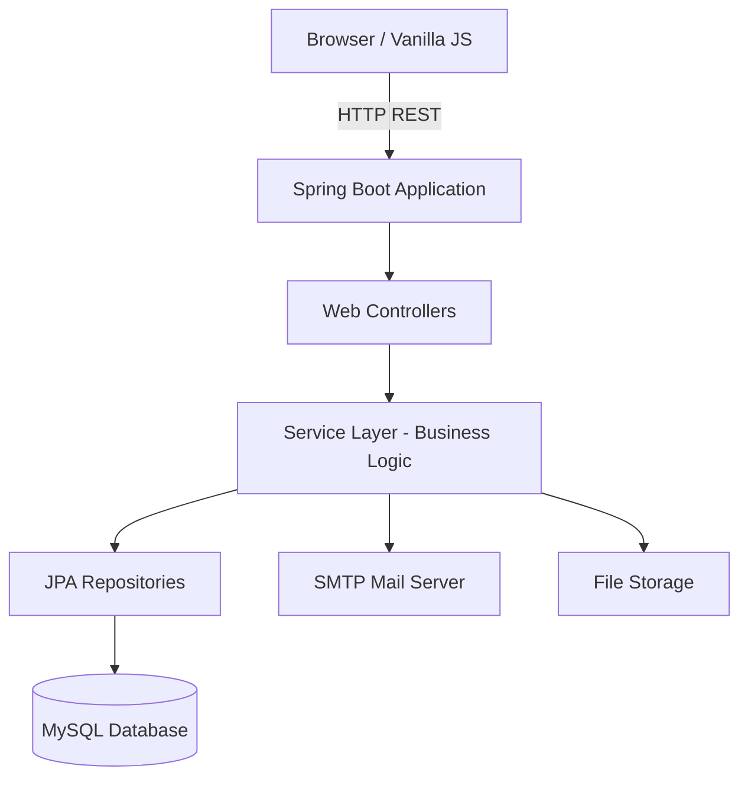

<h1 align="center">TellMe</h1>

<div align="center">
  
  
  
  
  
</div>

<br>

**TellMe** is an open-source student feedback, complaint, and discussion platform designed for universities, academic departments, and student organizations worldwide. It provides a centralized hub to bridge the communication gap between students and administration.

---

## 📸 Screenshots

| Dashboard | Submit Feedback | Forum |
| :---: | :---: | :---: |
| <!-- Add screenshot here --> <br>`dashboard.png` | <!-- Add screenshot here --> <br>`feedback.png` | <!-- Add screenshot here --> <br>`forum.png` |

---

## ✨ Features

- 🔐 **Authentication & Authorization**: Secure login for students and administrators.
- 📝 **Complaint & Submission System**: Easily file complaints, suggestions, or general feedback.
- 💬 **Discussion Forum**: Engage in open discussions with peers and faculty.
- 🗣️ **Forum Comments**: Deeply nested comment threads for interactive debates.
- 📊 **Status Tracking**: Track the lifecycle of your feedback (Pending, In Progress, Resolved).
- 🛠️ **Admin Dashboard**: Comprehensive dashboard for staff to manage and respond to submissions.
- 🖼️ **Image Upload**: Attach visual evidence or context to your complaints.
- 📧 **Email Notifications**: Automated updates on status changes and new comments.

## 🏗️ Architecture



## 🛠️ Tech Stack

| Domain | Technology |
|---|---|
| **Backend** | Java 17+, Spring Boot 3.x, Spring Data JPA, Spring Web |
| **Frontend** | HTML5, CSS3, Vanilla JavaScript (ES6+) |
| **Database** | MySQL 8.x |
| **Build Tool** | Maven / Gradle |

## 📦 Prerequisites

Before you begin, ensure you have met the following requirements:
- **Java**: JDK 17 or higher
- **MySQL**: 8.0 or higher
- **Maven/Gradle**: For building the project

## 🚀 Quick Start

1. **Clone the repository:**
   ```bash
   git clone https://github.com/TellMe Contributors/tellme.git
   cd tellme
   ```

2. **Database Setup:**
   Create a MySQL database named `tellme_db`.
   ```sql
   CREATE DATABASE tellme_db;
   ```

3. **Configure Environment:**
   Update the `src/main/resources/application.properties` (or use environment variables) as described in the Configuration section.

4. **Build and Run:**
   ```bash
   ./mvnw spring-boot:run
   ```
   The application will be available at `http://localhost:8080`.

## ⚙️ Configuration

Set the following environment variables or configure them in `application.properties`:

| Variable | Description | Default Value |
|---|---|---|
| `SPRING_DATASOURCE_URL` | MySQL Connection URL | `jdbc:mysql://localhost:3306/tellme_db` |
| `SPRING_DATASOURCE_USERNAME` | Database username | `root` |
| `SPRING_DATASOURCE_PASSWORD` | Database password | `password` |
| `MAIL_HOST` | SMTP Server Host | `smtp.gmail.com` |
| `MAIL_PORT` | SMTP Server Port | `587` |
| `MAIL_USERNAME` | SMTP Username | `your-email@example.com` |
| `MAIL_PASSWORD` | SMTP Password/App Password | `your-app-password` |
| `UPLOAD_DIR` | Directory for image uploads | `/uploads` |

## 🐳 Docker Quick Start

To run the application using Docker and Docker Compose:

1. Ensure Docker is running.
2. Run the compose file:
   ```bash
   docker-compose up --build
   ```
3. Access the app at `http://localhost:8080`.

## 📡 API Overview

| Method | Endpoint | Description | Auth Required |
|---|---|---|---|
| `POST` | `/api/auth/login` | Authenticate user | No |
| `POST` | `/api/complaints` | Submit a new complaint | Yes (Student) |
| `GET` | `/api/complaints` | List user's complaints | Yes |
| `PUT` | `/api/complaints/{id}/status` | Update complaint status | Yes (Admin) |
| `GET` | `/api/forum/posts` | Get all forum posts | Yes |
| `POST` | `/api/forum/posts/{id}/comments` | Add comment to post | Yes |

## 📂 Folder Structure

```text
tellme/
├── src/
│   ├── main/
│   │   ├── java/com/tellme/
│   │   │   ├── controllers/      # REST API Controllers
│   │   │   ├── models/           # JPA Entities
│   │   │   ├── repositories/     # Spring Data Repositories
│   │   │   ├── services/         # Business Logic
│   │   │   ├── security/         # Authentication configurations
│   │   │   └── TellMeApplication.java
│   │   └── resources/
│   │       ├── static/           # Vanilla JS, CSS, and Images
│   │       ├── templates/        # HTML Views
│   │       └── application.properties
├── pom.xml                       # Maven configuration
└── README.md
```

## 🛣️ Roadmap

- Improved UI/UX
- Mobile SDK
- Role-based permissions
See [ROADMAP.md](ROADMAP.md) for full details.

## 🤝 Contributing

We welcome contributions! Please see our [Contributing Guide](CONTRIBUTING.md) for details on how to get started, branch naming conventions, and pull request processes.

## 📜 License

This project is licensed under the MIT License - see the [LICENSE](LICENSE) file for details.

## 🆘 Support

If you need help, check out our [Support Guide](SUPPORT.md).

## 🙏 Credits

Thank you to all our contributors and the open-source community for making this project possible.
