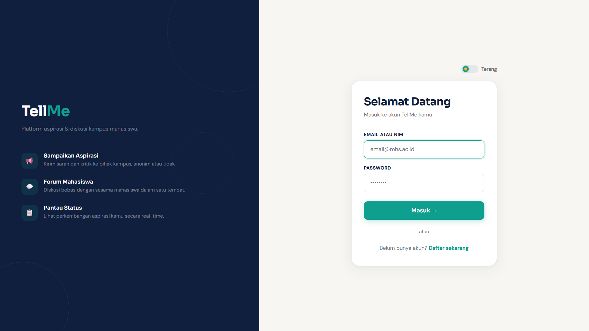
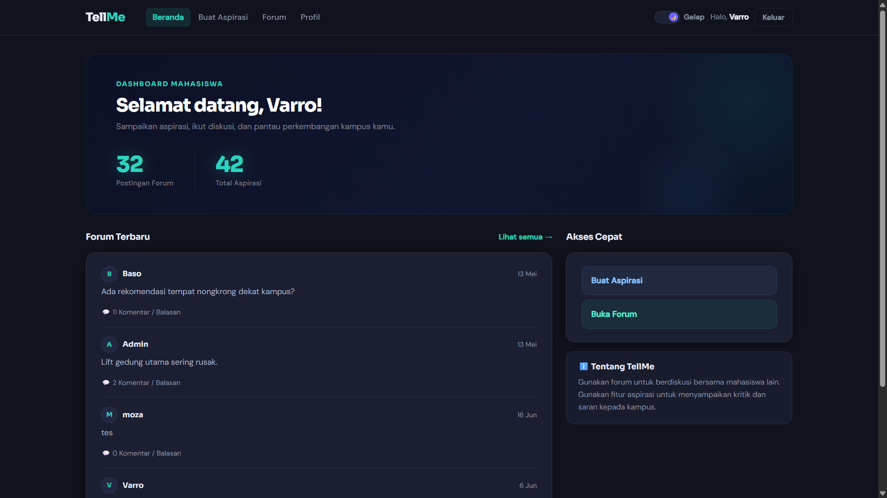
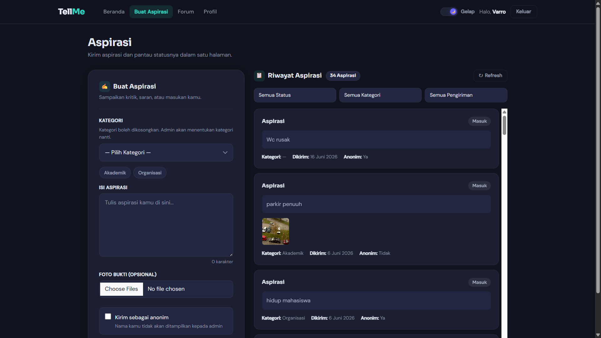
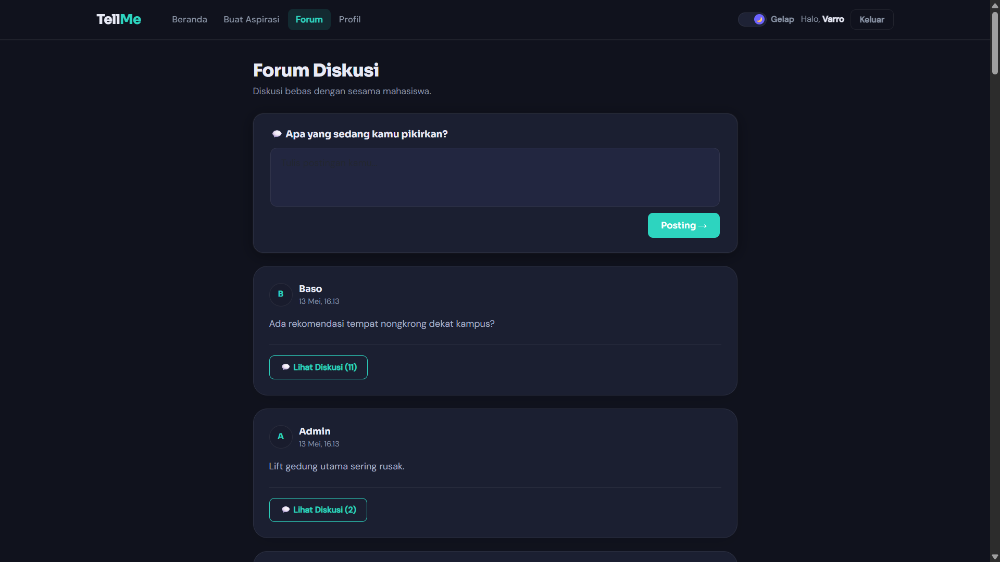
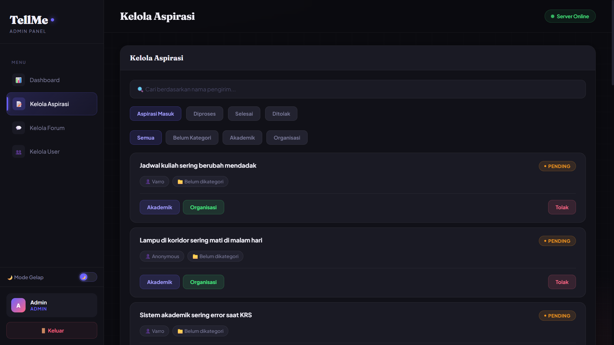
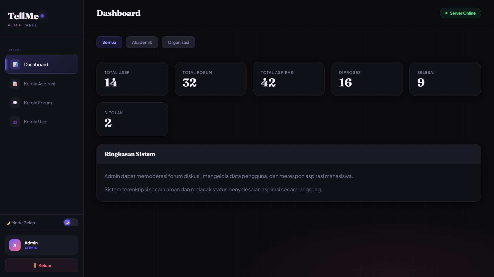
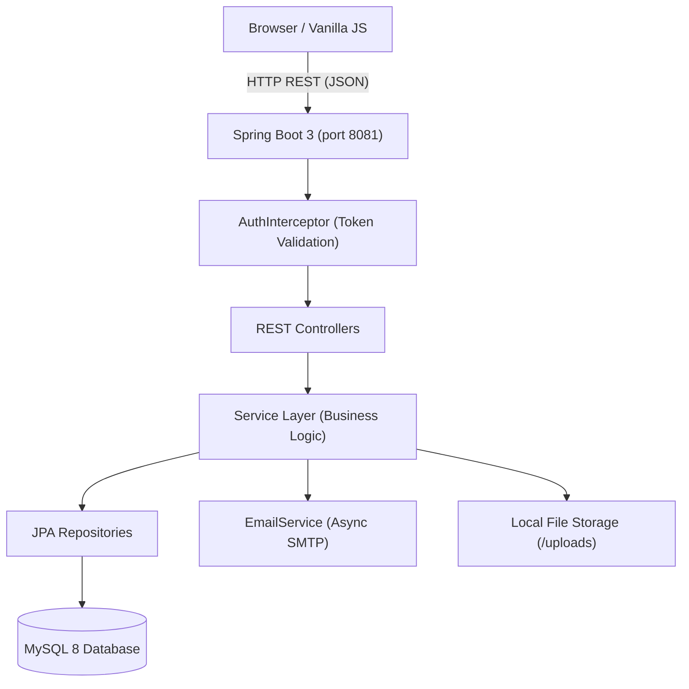

<h1 align="center">
  
  <br/>
  TellMe
</h1>

<p align="center">
  <strong>Open-source student feedback, complaint, and discussion platform</strong><br/>
  Designed for universities, academic departments, and student organizations worldwide.
</p>

<p align="center">
  <a href="https://github.com/Zulfatah69/tellme/actions/workflows/ci.yml">
    
  </a>
  <a href="https://github.com/Zulfatah69/tellme/actions/workflows/codeql.yml">
    
  </a>
  
  
  
  <a href="LICENSE">
    
  </a>
  <a href="CONTRIBUTING.md">
    
  </a>
</p>

---

## 📸 Screenshots

<p align="center">
  
  &nbsp;&nbsp;
  
</p>

<p align="center">
  
  &nbsp;&nbsp;
  
</p>

<p align="center">
  
  &nbsp;&nbsp;
  
</p>

> 📁 **Cara menambahkan screenshot:**
> 1. Buat folder `docs/screenshots/` di repository
> 2. Upload file gambar dengan nama: `login.png`, `dashboard.png`, `submit.png`, `forum.png`, `riwayat.png`, `admin.png`
> 3. Commit dan push — gambar akan otomatis tampil di sini

---

## ✨ Features

| Feature | Description |
|---|---|
| 🔐 **Authentication** | Token-based login for students (by email or NIM) and administrators |
| 📝 **Submission System** | File complaints, suggestions, or general feedback with optional anonymity |
| 📊 **Status Tracking** | Follow your submission through Pending → In Review → Resolved |
| 🛠️ **Admin Dashboard** | Manage submissions, assign categories, and write official responses |
| 💬 **Discussion Forum** | Open forum posts with threaded comments |
| 🖼️ **File Upload** | Attach up to 5 image / PDF files per submission |
| 📧 **Email Notifications** | Async SMTP notifications routed by submission category |
| 🔒 **BCrypt Passwords** | Industry-standard hashing with transparent SHA-256 migration |
| 📖 **OpenAPI / Swagger** | Interactive API docs at `/swagger-ui.html` |
| 🐳 **Docker Support** | One-command local setup via Docker Compose |

---

## 🏗️ Architecture



**Layer overview:**

| Layer | Package | Responsibility |
|---|---|---|
| Controllers | `com.tellme.controller` | HTTP request/response handling |
| Services | `com.tellme.service` | Business logic and orchestration |
| Repositories | `com.tellme.repository` | Spring Data JPA database access |
| DTOs | `com.tellme.dto` | API-safe data transfer objects |
| Entities | `com.tellme.model` | JPA entity definitions |
| Security | `com.tellme.config` | Token auth interceptor + CORS |
| Utilities | `com.tellme.util` | BCrypt password hashing |
| Exceptions | `com.tellme.exception` | Typed exceptions + global handler |

---

## 🛠️ Tech Stack

| Domain | Technology |
|---|---|
| **Backend** | Java 17, Spring Boot 3.4, Spring Data JPA, Spring Web |
| **Security** | Spring Security Crypto (BCrypt), custom `HandlerInterceptor` |
| **Database** | MySQL 8.x, Flyway migrations |
| **Frontend** | HTML5, CSS3, Vanilla JavaScript (ES6+) |
| **API Docs** | springdoc-openapi (Swagger UI) |
| **Build** | Apache Maven 3.6+, Maven Wrapper |
| **Testing** | JUnit 5, Mockito, H2 (in-memory for tests) |
| **DevOps** | Docker, GitHub Actions CI, CodeQL, Dependabot |

---

## 📦 Prerequisites

- **Java**: JDK 17 or higher
- **MySQL**: 8.0 or higher
- **Maven**: 3.6 or higher (or use included `./mvnw`)
- **Docker** *(optional)*: for containerized setup

---

## 🚀 Quick Start

### Option A — Local (Maven)

**1. Clone the repository:**
```bash
git clone https://github.com/Zulfatah69/tellme.git
cd tellme
```

**2. Create the database:**
```sql
CREATE DATABASE tellme_db CHARACTER SET utf8mb4 COLLATE utf8mb4_unicode_ci;
```

**3. Configure environment:**
```bash
# Copy the example and fill in real values
cp src/main/resources/application-example.properties src/main/resources/application-local.properties
# Edit application-local.properties with your DB and email credentials
```

Or export environment variables directly:
```bash
export DB_URL="jdbc:mysql://localhost:3306/tellme_db?createDatabaseIfNotExist=true&useSSL=false&serverTimezone=UTC"
export DB_USERNAME="root"
export DB_PASSWORD="your-db-password"
export MAIL_USERNAME="your-email@gmail.com"
export MAIL_PASSWORD="your-gmail-app-password"
```

**4. Run the application:**
```bash
./mvnw spring-boot:run
```

The app will be available at **`http://localhost:8081`**.  
Interactive API docs: **`http://localhost:8081/swagger-ui.html`**

---

### Option B — Docker Compose

```bash
git clone https://github.com/Zulfatah69/tellme.git
cd tellme

# Copy and fill in environment variables
cp .env.example docker/.env
# Edit docker/.env

# Build and start
docker compose -f docker/docker-compose.yml up --build
```

The app will be available at **`http://localhost:8081`**.

---

## ⚙️ Configuration

All configuration is driven by environment variables (recommended for production) or `application.properties`.

| Variable | Description | Default |
|---|---|---|
| `DB_URL` | Full MySQL JDBC URL | `jdbc:mysql://localhost:3306/tellme_db?...` |
| `DB_USERNAME` | Database username | `root` |
| `DB_PASSWORD` | Database password | *(empty)* |
| `MAIL_HOST` | SMTP server hostname | `smtp.gmail.com` |
| `MAIL_PORT` | SMTP port | `587` |
| `MAIL_USERNAME` | Sender email address | `your-email@gmail.com` |
| `MAIL_PASSWORD` | SMTP password / App Password | `your-app-password` |
| `MAIL_FROM` | From header address | Same as `MAIL_USERNAME` |
| `MAIL_ROUTING_ORGANISASI` | Recipient for "Organisasi" category | `admin@example.com` |
| `MAIL_ROUTING_AKADEMIK` | Recipient for "Akademik" category | `academic@example.com` |
| `UPLOAD_DIR` | File upload directory (relative path) | `uploads` |
| `UPLOAD_MAX_FILES` | Max files per upload request | `5` |
| `MAX_FILE_SIZE` | Max size per file | `5MB` |
| `SERVER_PORT` | HTTP port to listen on | `8081` |
| `SWAGGER_ENABLED` | Enable Swagger UI | `true` |
| `FLYWAY_ENABLED` | Enable Flyway DB migrations | `false` |

> 📝 See [`src/main/resources/application-example.properties`](src/main/resources/application-example.properties) for full documentation of all properties.

---

## 📡 REST API Overview

Base URL: `http://localhost:8081`

> For a complete, interactive reference, open **`http://localhost:8081/swagger-ui.html`** after starting the application.

| Method | Endpoint | Description | Auth |
|---|---|---|---|
| `POST` | `/api/auth/login` | Login — returns session token | No |
| `POST` | `/api/auth/logout` | Logout — invalidates session token | Bearer |
| `POST` | `/api/users` | Register a new user | No |
| `GET` | `/api/users` | List all users | Bearer (Admin) |
| `GET` | `/api/users/{id}` | Get a user by ID | Bearer |
| `PUT` | `/api/users/{id}` | Update user profile | Bearer |
| `DELETE` | `/api/users/{id}` | Delete a user | Bearer (Admin) |
| `POST` | `/api/aspirasi` | Create a new submission | Bearer |
| `GET` | `/api/aspirasi` | List submissions (with filters) | Bearer |
| `GET` | `/api/aspirasi/my` | Get my submissions | Bearer |
| `PUT` | `/api/aspirasi/{id}/status` | Update submission status | Bearer (Admin) |
| `PUT` | `/api/aspirasi/{id}/proses` | Process submission (assign category + status) | Bearer (Admin) |
| `PUT` | `/api/aspirasi/{id}/feedback` | Add admin feedback | Bearer (Admin) |
| `DELETE` | `/api/aspirasi/{id}` | Delete a submission | Bearer (Admin) |
| `GET` | `/api/aspirasi/dashboard` | Dashboard statistics | Bearer (Admin) |
| `GET` | `/api/aspirasi/top-kategori` | Most popular category | Bearer |
| `POST` | `/api/forum` | Create a forum post | Bearer |
| `GET` | `/api/forum` | List all forum posts | Bearer |
| `DELETE` | `/api/forum/{id}` | Delete a forum post | Bearer (Admin) |
| `POST` | `/api/forum-comment` | Create a forum comment / reply | Bearer |
| `GET` | `/api/forum-comment/{postId}` | Get comments for a post | Bearer |
| `DELETE` | `/api/forum-comment/{id}` | Delete a comment | Bearer (Admin) |
| `GET` | `/api/kategori` | List all categories | Bearer |
| `POST` | `/api/kategori` | Create a category | Bearer (Admin) |
| `PUT` | `/api/kategori/{id}` | Update a category | Bearer (Admin) |
| `DELETE` | `/api/kategori/{id}` | Delete a category | Bearer (Admin) |
| `GET` | `/api/status` | List all statuses | Bearer |
| `POST` | `/api/upload` | Upload attachment files | Bearer |

---

## 📂 Folder Structure

```text
tellme/
├── .github/
│   ├── ISSUE_TEMPLATE/          # Bug report & feature request templates
│   ├── workflows/               # GitHub Actions: CI, CodeQL
│   ├── dependabot.yml           # Automated dependency updates
│   └── PULL_REQUEST_TEMPLATE.md
├── docker/
│   ├── Dockerfile               # Multi-stage Docker build
│   ├── docker-compose.yml       # Production Compose
│   └── docker-compose.dev.yml   # Development Compose
├── docs/
│   ├── api.md                   # Full REST API reference
│   ├── architecture.md          # Architecture overview + diagrams
│   ├── configuration.md         # Configuration guide
│   └── installation.md          # Detailed installation guide
├── src/
│   ├── main/
│   │   ├── java/com/tellme/
│   │   │   ├── config/          # AuthInterceptor, WebMvcConfig, OpenApiConfig
│   │   │   ├── controller/      # REST API controllers
│   │   │   ├── dto/             # Data Transfer Objects
│   │   │   ├── exception/       # Typed exceptions + global handler
│   │   │   ├── model/           # JPA entities
│   │   │   ├── repository/      # Spring Data JPA interfaces
│   │   │   ├── service/         # Business logic (interfaces + implementations)
│   │   │   ├── util/            # PasswordUtil (BCrypt)
│   │   │   └── TellmeApplication.java
│   │   └── resources/
│   │       ├── static/          # Frontend (HTML, CSS, JavaScript)
│   │       ├── db/migration/    # Flyway SQL migration scripts
│   │       ├── application.properties
│   │       └── application-example.properties
│   └── test/
│       └── java/com/tellme/     # Unit & integration tests (JUnit 5, Mockito)
├── .editorconfig
├── .env.example
├── .gitignore
├── CHANGELOG.md
├── CODE_OF_CONDUCT.md
├── CONTRIBUTING.md
├── LICENSE
├── ROADMAP.md
├── SECURITY.md
├── SUPPORT.md
└── pom.xml
```

---

## 🗺️ Roadmap

See [ROADMAP.md](ROADMAP.md) for the full development plan.

**Upcoming in v1.1:**
- Server-side pagination for submissions and forum posts
- API rate limiting
- Cloud file storage (AWS S3 / compatible)
- Stricter input validation and sanitization

---

## 🤝 Contributing

We welcome contributions of all kinds!

1. Read [CONTRIBUTING.md](CONTRIBUTING.md) for setup instructions and conventions.
2. Check open [Issues](https://github.com/Zulfatah69/tellme/issues) for areas that need help.
3. Open a PR — new contributors welcome! 🎉

---

## 🔒 Security

If you discover a security vulnerability, please **do not open a public issue**.  
See [SECURITY.md](SECURITY.md) for our responsible disclosure process.

---

## 📜 License

This project is licensed under the **MIT License** — see the [LICENSE](LICENSE) file for details.

---

## 🆘 Support

- 💬 [GitHub Discussions](https://github.com/Zulfatah69/tellme/discussions) — questions, ideas, general chat
- 🐛 [GitHub Issues](https://github.com/Zulfatah69/tellme/issues) — bug reports and feature requests
- 📖 [Support Guide](SUPPORT.md) — FAQ and troubleshooting

---

## 🙏 Credits

TellMe is built with ❤️ using [Spring Boot](https://spring.io/projects/spring-boot), [MySQL](https://www.mysql.com/), and vanilla web standards.

Thank you to all contributors and the open-source community for making this project possible.
