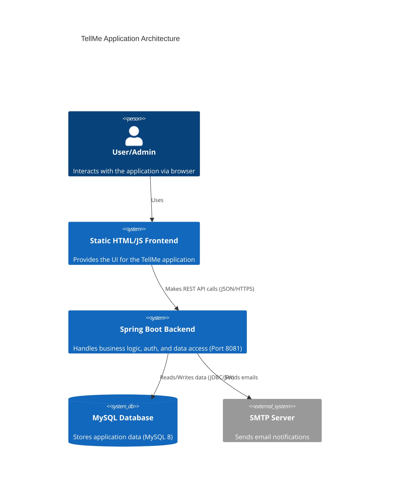
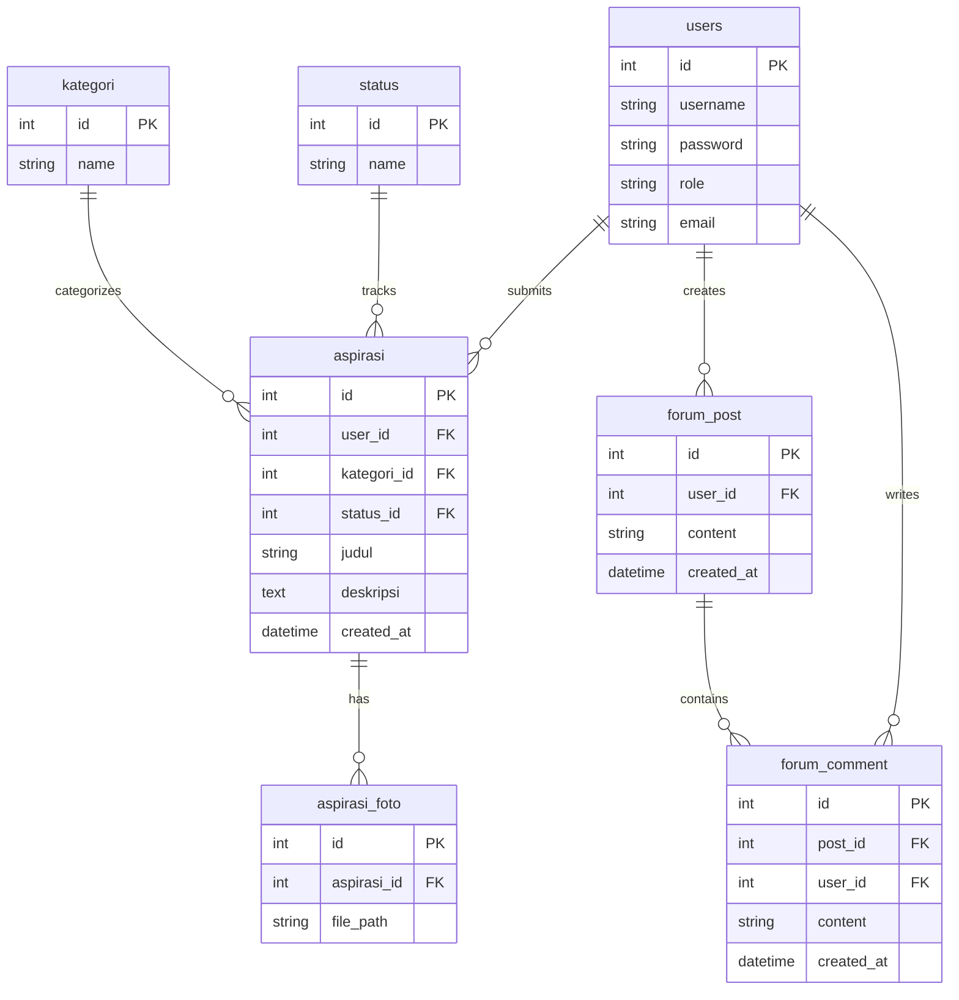
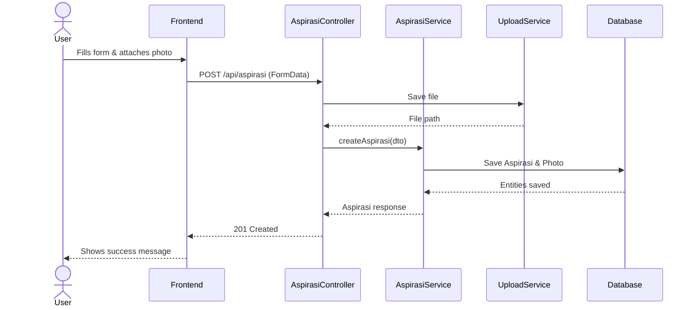
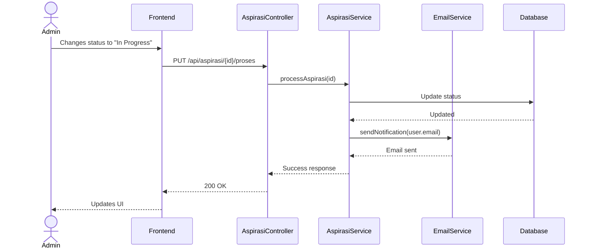

# Architecture Overview

TellMe is a modern web application built using a 3-tier architecture. It features a rich static frontend communicating via REST API with a robust Spring Boot backend, supported by a MySQL 8 relational database. The application employs standard layer separation for maintainability and scalability.

## High Level Architecture

## Layer Descriptions

- **Presentation Layer (Frontend)**: Composed of static HTML, CSS, and plain JavaScript. No server-side rendering (no Thymeleaf) is used. It handles user interactions and renders UI asynchronously.
- **API Layer (Controllers)**: Receives HTTP requests, validates input, calls the Service Layer, and formats HTTP responses (JSON).
- **Service Layer**: Contains core business logic, orchestrates interactions between entities, and triggers external services (e.g., Email Service, File Upload).
- **Persistence Layer (Repositories)**: Spring Data JPA interfaces that interact directly with the MySQL database.

## Entity Relationship Diagram

## Sequence Diagrams

### Submit a Complaint Flow

### Admin Reviews Submission Flow

## Authentication Mechanism
TellMe uses a token-based authentication mechanism. Upon successful login (`/api/auth/login`), a secure token is generated, stored in the database, and returned to the client. The frontend must include this token in the `Authorization: Bearer <token>` header for all protected API requests. 

## Architectural Limitations & Planned Improvements
- **Limitation**: Token storage in the database can cause performance bottlenecks under high load.
- **Improvement**: Migrate to stateless JWT (JSON Web Tokens) to remove database lookups for authentication.
- **Limitation**: Uploaded files are stored on the local filesystem, hindering horizontal scalability.
- **Improvement**: Integrate with an S3-compatible object storage service.
